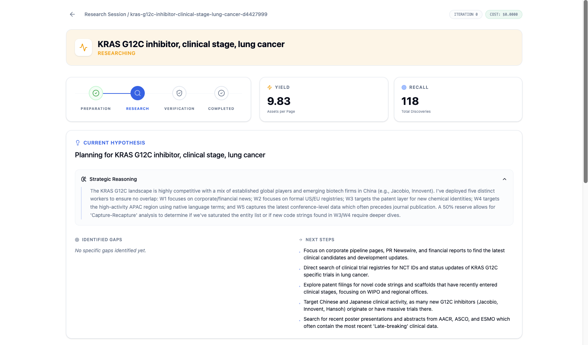

# Sourcing Agent

Deep Research Agent for drug discovery and biomedical entity discovery. Built for high-recall discovery of therapeutic assets using an iterative, multi-agentic workflow.

## 🏗️ Architecture Overview

The system employs a **dual-layered orchestration strategy** to balance durability with agentic flexibility:

-   **Temporal Layer**: Acts as the "backbone." It manages the high-level workflow state, ensuring research sessions can run for hours (or days) with built-in retries, persistence, and fault tolerance.
-   **LlamaIndex Workflows**: Acts as the "brain." It orchestrates the internal agentic reasoning loops, event-driven transitions, and parallel worker dispatches within each iteration. This allows for complex, non-linear discovery paths that are difficult to model in traditional state machines.

## 🔄 The Research Loop

The agent follows an iterative, self-correcting cycle:

1.  **Initial Planning**: Synthesizes the research topic into hard/soft constraints using multi-step reasoning.
2.  **Parallel Worker Execution**: Dispatches specialized workers to search (Perplexity/Tavily) and crawl specific targets.
3.  **Advanced Extraction (LlamaExtract + Crawl4AI)**: Directly extracts schema-aligned data from raw web content. By crawling first and extracting later, we minimize "hallucination by truncation" often seen in standard search snippets.
4.  **Adaptive Update**: The orchestrator calculates a **Novelty Metric** (new entities vs. pages fetched). If discovery yields diminish, the planner pivots the strategy, kills unproductive workers, and spawns new ones with fresh queries.
5.  **Multi-Tier Verification**: Every discovery is audited against a **4-tier evidence weighting system** (Regulatory filings > Corporate Pipeline > News > Speculative).
6.  **Reconciliation & Gap-Filling**: Merges aliases into canonical records and triggers "Deep Read" targeted searches to fill missing critical fields (e.g., Owner or Clinical Phase).


## 📸 Walkthrough

### 1. Planning Stage
The system starts by analyzing the query to generate a comprehensive plan and synonym list.


### 2. Adaptive Discovery Loop
Workers execute in parallel, visualizing their progress and the growing knowledge graph in real-time.


### 3. Final Verification & Results
After saturation, the system deduplicates and verifies assets, presenting a final auditable table.


## 🛠️ Tech Stack & Rationales

| Component | Technology | Rationale |
| :--- | :--- | :--- |
| **Orchestration** | Temporal | Ensuring research sessions are durable and resumable across worker restarts. |
| **Agent Logic** | LlamaIndex Workflows | Dynamic, event-driven orchestration of complex LLM reasoning chains. |
| **Deep Search** | Perplexity API | Context-heavy, reasoning-informed searching for initial landscape analysis. |
| **Rapid Search** | Tavily | Fast, snippet-to-markdown discovery for high-velocity parallel crawling. |
| **Extraction** | Crawl4AI + Gemini Flash | Efficient headless browsing combined with schema-based extraction from raw HTML/PDFs. |
| **LLMs** | Gemini 3 & 2.5 | Reasoning (3-Flash-Preview) for planning/verification; Speed (2.5-Flash-Lite) for extraction. |
| **Persistence** | SQLAlchemy (Async) | Decoupled domain models from DB logic, allowing seamless switching between SQLite and PostgreSQL. |
| **Shared State** | Redis | Atomic, high-speed URL and entity tracking to prevent redundant work across parallel workers. |

## 🚀 Setup

### 1. Environment Variables
Copy `.env.example` to `.env` and fill in your API keys:
- `PERPLEXITY_API_KEY`, `TAVILY_API_KEY`, `LLAMA_CLOUD_API_KEY`
- `GOOGLE_API_KEY` (Gemini), `TEMPORAL_API_KEY`

### 2. Docker Setup
```bash
docker-compose up --build
```
- **Frontend**: `http://localhost:8501`
- **Worker**: Background Temporal worker listening for tasks.

#### Run a Research Task via CLI
```bash
docker-compose run worker python backend/run.py "Your research topic"
```

## 💻 Local Development

### 1. Setup Environment
```bash
python -m venv env
source env/bin/activate  # On macOS/Linux
pip install -r requirements.txt
```

### 2. Run Components
- **Worker**: `python backend/worker.py`
- **Frontend**: `streamlit run frontend/app.py`
- **CLI Runner**: `python backend/run.py "Your topic"`
